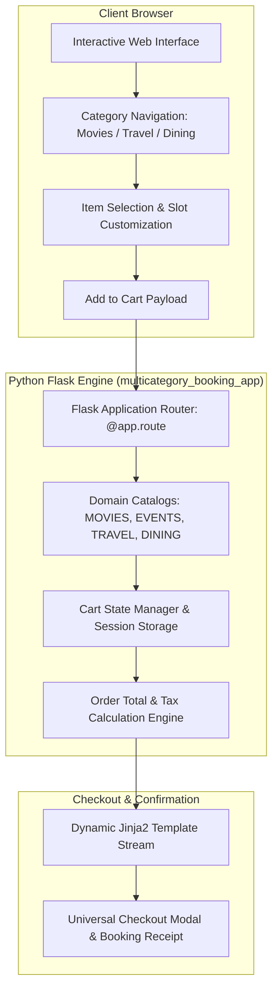

<div align="center">

# 🎫 my_first_project — BookIt Multi-Domain Reservation & Universal Cart Engine
### Production-Grade Full-Stack Booking Platform & Universal Cart Architecture Built with Python & Flask

[](https://www.python.org/)
[](https://flask.palletsprojects.com/)
[](https://developer.mozilla.org/en-US/docs/Web/HTML)
[](https://github.com/harinarayana1457-cmyk/my_first_project)
[](https://opensource.org/licenses/MIT)

<p align="center">
  <b>BookIt</b> is an all-in-one reservation and ticketing platform engineered to consolidate disparate daily booking flows into a single, cohesive experience. By eliminating the friction of context-switching between separate apps, BookIt lets users browse, select, and manage reservations across <b>cinema</b>, <b>live events</b>, <b>intercity travel</b>, and <b>fine dining</b> through a centralized shopping cart and checkout architecture.
</p>

[✨ Key Features](#-key-features) • [🏛️ Architecture](#-booking-pipeline-architecture) • [🚀 Quickstart](#-quickstart-guide) • [🛠️ Tech Stack](#️-tech-stack) • [📁 Structure](#-project-structure)

</div>

---

## 🌟 Key Features

* **🎟️ 4-in-1 Unified Booking Categories**:
  * **🎬 Cinema**: Browse movie releases (e.g. *Dune: Part Two*, *Pushpa 2*), view runtime/ratings, select theater chains (PVR, INOX, Cinepolis), and pick showtimes.
  * **🎸 Concerts & Live Events**: Music festivals, stand-up comedy, and campus events with tier-based ticketing.
  * **✈️ Intercity Travel**: Flight, train, and express bus booking with departure/arrival scheduling.
  * **🍽️ Table Reservations**: Curate restaurant seating, party sizes, and custom dining timeslots.
* **🛒 Centralized Universal Cart**: Add multiple reservations across different domains into a single universal cart, tracking total costs and item details before checkout.
* **🔍 Instant Category Filtering & Search**: Real-time keyword filtering across title, genre, venue, and release schedules.
* **📱 Responsive Single-File Architecture**: Self-contained Flask application delivering dynamic HTML templates with zero external front-end build step.

---

## 🏛️ Booking Pipeline Architecture



---

## 🛠️ Tech Stack

| Domain | Technologies |
| :--- | :--- |
| **Backend Framework** | Python 3, Flask (Lightweight WSGI Microframework) |
| **Template Engine** | Jinja2 / `render_template_string` |
| **Data Format** | JSON in-memory schema catalogs |
| **Styling & UI** | Semantic HTML5, CSS3 responsive grid & flexbox |

---

## 🚀 Quickstart Guide

### Prerequisites
* **Python 3.8 or higher**
* **pip** package installer

### 1. Clone the Repository
```bash
git clone https://github.com/harinarayana1457-cmyk/my_first_project.git
cd my_first_project
```

### 2. Install Dependencies
```bash
pip install flask
```

### 3. Run the Application
Launch the Flask server:
```bash
python multicategory_booking_app
```

### 4. Access BookIt
Open your web browser and navigate to:
```text
http://localhost:5000
```

---

## 📁 Project Structure

```text
my_first_project/
├── multicategory_booking_app # Complete 900+ line Flask web app (server + templates + APIs)
├── .gitignore                # Python cache, virtual environments, and OS files
└── README.md                 # Project documentation
```

---

## 📄 License & Credits

* Developed by **[Hari Narayana (@harinarayana1457-cmyk)](https://github.com/harinarayana1457-cmyk)**.
* Distributed under the **MIT License**.
